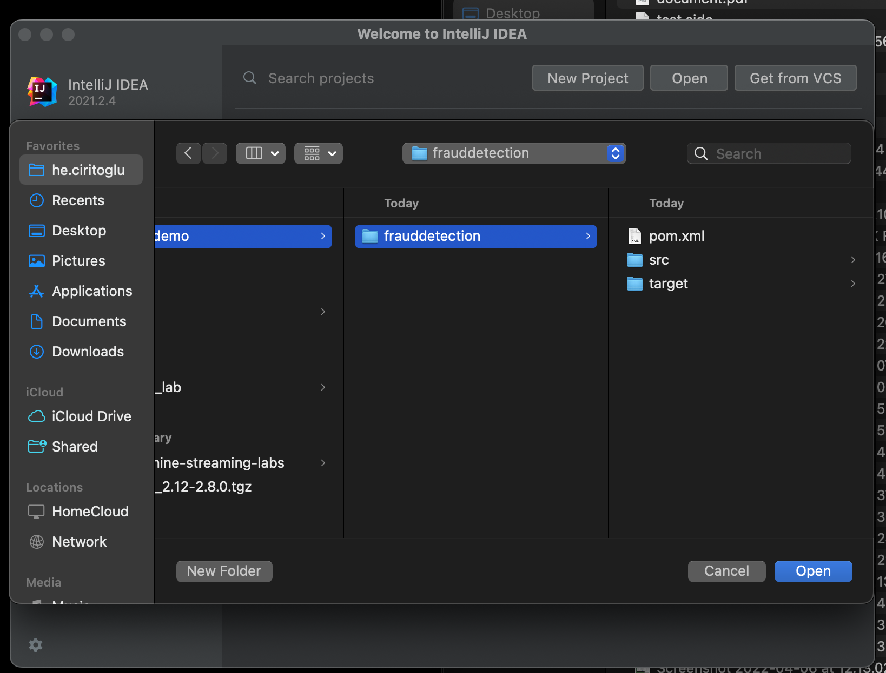
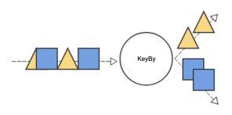
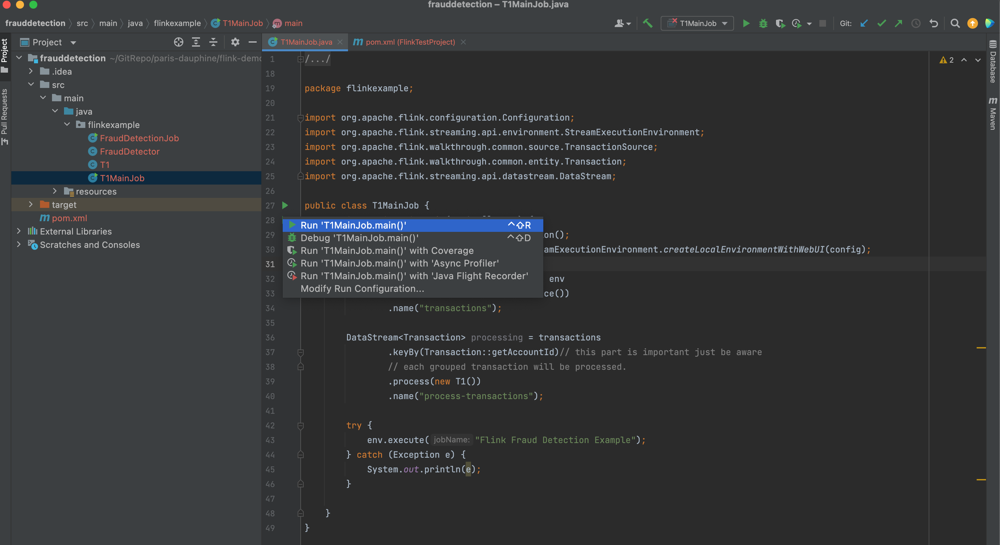

# Flink Lab

## prerequisite

Make sure java and mvn(Maven) are installed in your workstation.

## Let's start working on Flink

Open your project with your favourite IDE(I use intellij).




You have two file FraudDetecionJob.java and FraudDetector.java as a template.

But you will be working on your copy called T1.java and T1MainJob.java

T1.java includes process will be executed in T1MainJob.java


In T1MainJob.java, data is generated via the following piece code:

``` java
DataStream<Transaction> transactions = env
                .addSource(new TransactionSource())
                .name("transactions");

```

If you check transaction class, you will see there basically three fields:

``` java
private long accountId;
private long timestamp;
private double amount;
```


## T1) Print all transactions along with the account id
please create for your process, let's create a new class called T1.java for the new class to implement Task#1
for this you need add the following line in T1 class
``` java
    String accountNo = String.valueOf(transaction.getAccountId());
    long incomingValue = Double.valueOf(transaction.getAmount()).longValue();
```
like this

``` java
    String accountNo = String.valueOf(transaction.getAccountId());
    long incomingValue = Double.valueOf(transaction.getAmount()).longValue();
    logger.info("DEBUG: Account:" + accountNo + " Incoming Value:" + incomingValue); 
```

now, let's have a look main class as a T1MainJob.java and run it:

``` java

import org.apache.flink.configuration.Configuration;
import org.apache.flink.streaming.api.environment.StreamExecutionEnvironment;
import org.apache.flink.walkthrough.common.source.TransactionSource;
import org.apache.flink.walkthrough.common.entity.Transaction;
import org.apache.flink.streaming.api.datastream.DataStream;

public class T1MainJob {
    public static void main(String[] args) {
        Configuration config = new Configuration();
        StreamExecutionEnvironment env =  StreamExecutionEnvironment.createLocalEnvironmentWithWebUI(config);

        DataStream<Transaction> transactions = env
                .addSource(new TransactionSource())
                .name("transactions");

        DataStream<Transaction> processing = transactions
                .keyBy(Transaction::getAccountId)// this part is important just be aware 
                                                 // each grouped transaction will be processed.
                .process(new T1())
                .name("print-transactions");

        try {
            env.execute("Flink Fraud Detection Example");
        } catch (Exception e) {
            System.out.println(e);
        }

    }
}
```

### What is keyby?



"Logically partitions a stream into disjoint partitions. All records with the same key are assigned to the same partition. Internally, keyBy() is implemented with hash partitioning. There are different ways to specify keys."

[From Flink Project Documentation](https://nightlies.apache.org/flink/flink-docs-master/docs/dev/datastream/operators/overview/)

If you run your code by pressing green triangle on T1MainJob.



you should see our transactions printed...


## T2) Print each received data if the value is higher than 500

Use Task1 as template, modify only inside of T1 job and print only if incomingValue is bigger than 500.

## T3) Print the first account whose sum of all transactions bigger than 1000.

**For this task, you need to remember previous values**, so you need to use a **"State"**. As the name refers, it is a state of operator; therefore your operator (task) can remember what it processed before.
Let's create the state first as a new class

``` java
// Define the new class as a state :
public class FraudDetectorState {
    public String key;
    public double valueSumUp = 0;
    public int count = 0;
}
```

We should increase valueSumUp everytime when we see new transaction. We can modify T1 accordingly.
Please make following modification in open method of T1.java

``` java
   @Override
    public void open(Configuration parameters) throws Exception {
        state = getRuntimeContext().getState(new ValueStateDescriptor<>("T4FraudDetectorState", T4State.class));
    }
```

also in the processElement

``` java
    public void processElement(Transaction transaction, KeyedProcessFunction<Long, Transaction, Transaction>.Context context, Collector<Transaction> collector) throws Exception {
        // retrieve the current count
        String accountNo = String.valueOf(transaction.getAccountId());
        long incomingValue = Double.valueOf(transaction.getAmount()).longValue();

        T4State current = state.value();
                if (current == null) {
                    current = new T4State(accountNo);
                }
        }

        long currValue = current.valueSumUp;
        currValue += incomingValue;
        logger.info("DEBUG: Account:" + accountNo + " Incoming Value:" + incomingValue + " new sum:" + currValue);
        state.update(current);
        collector.collect(transaction);

```

## T4) Print the account whose sum of last three transaction bigger than 800


## T5) Detect a real credit card fraud
The data analysts in your team have detected an interesting pattern. They noticed that when an account makes a small transaction immediately 
followed by a large one, most likely those are fraudulent transactions.
They asked you to detect and print accountIds that have this fraudulent pattern in order to forward a warning to the account owner
in the briefer delays.

### Fraud detector MVP
Update the process Operator in a way it detects two successive transactions from the same account, the first transaction with a value smaller than SMALL_AMOUNT = 1
and the second transaction with a value greater than BIG_AMOUNT = 500. 

### Fraud detector v1
The MVP version detects the fraudulent pattern, but it also generates a lot of false positive because it doesn't take into account 
the time of transactions. The two transactions should be done close in time to be considered fraudulent (e.g. 1 minute).